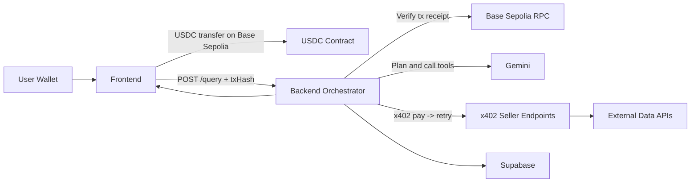

## Overview

Arcana is a full-stack crypto AI orchestration system that combines paid agent services with blockchain micropayments. Users pay to ask questions, and the system automatically routes those queries through specialized AI agents that charge per-call using the x402 payment protocol.

## High-Level Architecture

The system consists of three main layers:

<CardGroup cols={3}>
  <Card title="Frontend" icon="browser">
    React + Vite application for user interaction, wallet connection, and payment submission
  </Card>
  <Card title="Backend" icon="server">
    Express orchestrator that verifies payments, routes queries, and manages agent calls
  </Card>
  <Card title="Agents" icon="robot">
    Specialized services that provide crypto intelligence through paid x402 endpoints
  </Card>
</CardGroup>

## Architecture Diagram

## Component Responsibilities

### Frontend (`arc-agent-hub`)

<AccordionGroup>
  <Accordion title="Wallet Management">
    - Connect user wallets via Web3 providers
    - Switch to Base Sepolia network
    - Display USDC balance and transaction history
  </Accordion>

  <Accordion title="Payment Handling">
    - Submit USDC payment transactions ($0.03 per query)
    - Track transaction confirmation status
    - Display payment receipts and proof
  </Accordion>

  <Accordion title="Chat Interface">
    - Render conversational UI for queries
    - Display agent responses with rich formatting
    - Show which agents were called for each query
  </Accordion>

  <Accordion title="Dashboard">
    - View available agents and their prices
    - Monitor agent performance and reliability
    - Manage policy controls (freeze/reactivate agents)
  </Accordion>
</AccordionGroup>

### Backend Orchestrator

The backend is the heart of the system, coordinating payments, AI reasoning, and agent calls.

<Tabs>
  <Tab title="Payment Verification">
    **On-Chain Payment Verification**
    
    When a query arrives with a transaction hash:
    1. Fetch transaction receipt from Base Sepolia RPC
    2. Verify transaction is confirmed and successful
    3. Validate payment amount ($0.03 USDC minimum)
    4. Check recipient address matches backend wallet
    5. Ensure transaction hasn't been used before
    
    Only after successful verification does the backend process the query.
  </Tab>

  <Tab title="AI Orchestration">
    **Gemini-Powered Tool Selection**
    
    The backend uses Gemini 2.5 Flash to:
    - Analyze user intent from the query
    - Select appropriate specialized agents
    - Chain multiple agent calls when needed
    - Synthesize agent responses into coherent answers
    
    Example: "What's the price of ETH and best yield for it?"
    → Calls Oracle agent (price) + Yield agent (opportunities)
  </Tab>

  <Tab title="x402 Agent Calls">
    **HTTP 402 Payment Flow**
    
    Each agent call follows the x402 protocol:
    1. **Preflight**: Backend calls agent endpoint
    2. **402 Response**: Agent returns payment requirement
    3. **Payment**: Backend submits on-chain payment
    4. **Retry**: Backend retries with payment proof
    5. **200 Success**: Agent returns requested data
    
    All agent payments use CDP wallets managed by the backend.
  </Tab>

  <Tab title="Policy Enforcement">
    **Admin Controls**
    
    Before executing any agent call, the backend checks:
    - **Freeze Status**: Is the agent currently frozen?
    - **Endpoint Allowlist**: Is this endpoint permitted?
    - **PayTo Allowlist**: Is the recipient address approved?
    - **Spend Limits**: Per-call and daily spending caps
    - **Circuit Breaker**: Has the agent failed too many times?
    
    Policy violations are logged with detailed reasons.
  </Tab>
</Tabs>

### Smart Contracts

Deployed on Base Sepolia:

<Card title="PolicyVault" icon="shield">
  Stores agent policies, spend limits, and allowlists for governance
</Card>

<Card title="Escrow" icon="lock">
  Manages escrow deposits for trustless agent-to-agent payments
</Card>

<Card title="AgentRegistry" icon="address-book">
  Registry of all deployed agents with metadata and addresses
</Card>

## Data Flow

### User Query Flow

<Steps>
  <Step title="User Submits Query">
    User types a question and signs a USDC transfer transaction for $0.03
  </Step>
  
  <Step title="Payment Verification">
    Backend verifies the transaction on Base Sepolia and confirms receipt
  </Step>
  
  <Step title="Intent Analysis">
    Gemini analyzes the query to determine which agents to call
  </Step>
  
  <Step title="Agent Execution">
    Backend calls selected agents via x402, paying per call (e.g., Oracle $0.01, Yield $0.01)
  </Step>
  
  <Step title="Response Synthesis">
    Gemini combines agent responses into a coherent answer
  </Step>
  
  <Step title="User Receives Answer">
    Frontend displays the answer with payment proof and agent attribution
  </Step>
</Steps>

### x402 Payment Flow

See [x402 Protocol](/concepts/x402-protocol) for detailed protocol specification.

## Technology Stack

<CardGroup cols={2}>
  <Card title="Frontend">
    - **Framework**: React 18 + Vite
    - **Web3**: Wagmi + Viem
    - **UI**: TailwindCSS + Radix UI
    - **State**: React Query
  </Card>
  
  <Card title="Backend">
    - **Runtime**: Node.js 18+ + TypeScript
    - **Framework**: Express.js
    - **AI**: Gemini 2.5 Flash API
    - **x402**: @x402/express middleware
  </Card>
  
  <Card title="Blockchain">
    - **Network**: Base Sepolia (Chain ID: 84532)
    - **Token**: USDC (0x036CbD53...)
    - **RPC**: https://sepolia.base.org
    - **Wallet**: Coinbase CDP SDK
  </Card>
  
  <Card title="Infrastructure">
    - **Database**: Supabase (PostgreSQL)
    - **Contracts**: Foundry (Solidity)
    - **APIs**: CoinGecko, DeFiLlama, OpenSea, etc.
  </Card>
</CardGroup>

## Security Considerations

<Warning>
  **Demo Environment**: This system runs on Base Sepolia testnet with test USDC. Not for production use.
</Warning>

<AccordionGroup>
  <Accordion title="Payment Security">
    - All payments verified on-chain before query processing
    - Transaction hashes tracked to prevent replay attacks
    - Payment amounts validated against minimum thresholds
    - Failed verifications logged for audit
  </Accordion>

  <Accordion title="Agent Security">
    - Policy-based access control for all agent endpoints
    - Circuit breaker protection against failing agents
    - Spend limits enforced per-call and per-day
    - Allowlists for endpoints and recipient addresses
  </Accordion>

  <Accordion title="Key Management">
    - CDP SDK for secure wallet provisioning
    - Private keys stored in environment variables
    - Separate buyer/seller wallets for each agent
    - Admin API key required for policy changes
  </Accordion>
</AccordionGroup>

## Scalability & Performance

<Info>
  **Caching Strategy**: Agent responses cached for 30-60 seconds to reduce API costs and improve latency.
</Info>

- **Parallel Agent Calls**: Multiple agents called concurrently when independent
- **Preflight Caching**: x402 payment requirements cached to avoid duplicate preflights
- **Provider Scoring**: Pinion runtime tracks agent performance for intelligent routing
- **Rate Limiting**: Per-endpoint rate limits prevent abuse

## Next Steps

<CardGroup cols={2}>
  <Card title="x402 Protocol" icon="handshake" href="/concepts/x402-protocol">
    Learn how HTTP 402 enables pay-per-call agent services
  </Card>
  <Card title="Payment Flow" icon="coins" href="/concepts/payment-flow">
    Understand the end-to-end payment process
  </Card>
  <Card title="Agent Marketplace" icon="store" href="/concepts/agent-marketplace">
    Explore the 7 specialized agents and their capabilities
  </Card>
</CardGroup>
