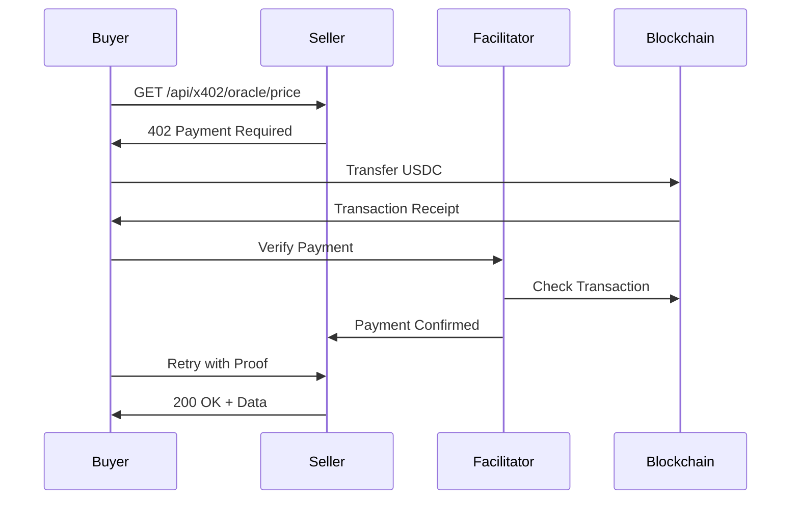

## What is x402?

The **x402 protocol** enables pay-per-call HTTP APIs using blockchain micropayments. It's based on the HTTP 402 "Payment Required" status code, which was originally reserved but never standardized.

<Info>
  **Key Concept**: Instead of subscriptions or API keys, services charge per-request. Users pay only for what they use.
</Info>

In Arcana, every agent endpoint uses x402 to charge for its services. The backend orchestrator automatically handles payments when calling agents.

## How x402 Works

### Standard HTTP 402 Flow

<Steps>
  <Step title="Initial Request">
    Client makes a regular HTTP request to the protected endpoint:
    ```bash
    GET /api/x402/oracle/price?symbol=BTC
    ```
  </Step>

  <Step title="402 Payment Required">
    Server responds with HTTP 402 and payment details:
    ```json
    {
      "accepts": [{
        "scheme": "exact",
        "network": "eip155:84532",
        "payTo": "0xbaFF2E0939f89b53d4caE023078746C2eeA6E2F7",
        "amount": "10000000000000000",
        "asset": "0x036CbD53842c5426634e7929541eC2318f3dCF7e"
      }]
    }
    ```
  </Step>

  <Step title="Payment Submission">
    Client submits on-chain payment to the specified address:
    ```typescript
    await usdcContract.transfer(
      payTo,
      amount
    );
    ```
  </Step>

  <Step title="Retry with Proof">
    Client retries the request with payment proof in headers:
    ```bash
    GET /api/x402/oracle/price?symbol=BTC
    X-Payment: {base64-encoded-payment-proof}
    ```
  </Step>

  <Step title="200 Success">
    Server verifies payment and returns the requested data:
    ```json
    {
      "success": true,
      "data": { "symbol": "BTC", "price": 97234.50 }
    }
    ```
  </Step>
</Steps>

## x402 in Arcana

### Two Payment Layers

Arcana implements a **two-tier payment system**:

<CardGroup cols={2}>
  <Card title="User → Backend" icon="user">
    **Upfront Query Payment**
    
    Users pay $0.03 USDC to the backend orchestrator before asking questions.
    
    This covers:
    - AI orchestration (Gemini API)
    - Multiple agent calls
    - Response synthesis
    - Infrastructure costs
  </Card>

  <Card title="Backend → Agents" icon="robot">
    **Per-Call Agent Payments**
    
    Backend pays each agent per-call using x402:
    
    - Oracle: $0.01 per price lookup
    - Scout: $0.01 per on-chain query
    - News: $0.01 per news search
    - Yield: $0.01 per yield search
    - Tokenomics: $0.02 per analysis
    - NFT: $0.02 per collection lookup
    - Perp: $0.02 per market data
  </Card>
</CardGroup>

### Protocol Versions

x402 supports two protocol versions:

<Tabs>
  <Tab title="Version 1 (Legacy)">
    **Payment requirement in response body**
    
    ```json
    HTTP/1.1 402 Payment Required
    
    {
      "accepts": [{
        "network": "eip155:84532",
        "payTo": "0x...",
        "maxAmountRequired": "10000000000000000",
        "asset": "0x036CbD..."
      }]
    }
    ```
    
    <Info>
      Used by older agent implementations. Still supported for backward compatibility.
    </Info>
  </Tab>

  <Tab title="Version 2 (Current)">
    **Payment requirement in header**
    
    ```http
    HTTP/1.1 402 Payment Required
    PAYMENT-REQUIRED: eyJhY2NlcHRzIjpbeyJuZXR3b3JrIjoi...
    
    {}
    ```
    
    The `PAYMENT-REQUIRED` header contains base64-encoded JSON:
    
    ```json
    {
      "accepts": [{
        "network": "eip155:84532",
        "payTo": "0x...",
        "amount": "10000000000000000",
        "asset": "0x036CbD..."
      }]
    }
    ```
    
    <Note>
      Cleaner separation of protocol metadata from response body.
    </Note>
  </Tab>
</Tabs>

## Payment Schemes

### Exact Scheme

The **exact** scheme requires precise payment amounts:

```typescript
{
  "scheme": "exact",
  "price": "$0.01",           // Human-readable
  "network": "eip155:84532",  // Base Sepolia
  "payTo": "0x...",           // Seller wallet
}
```

- Payment must match the exact amount specified
- No overpayment or underpayment accepted
- Simplest and most predictable scheme

<Check>
  All Arcana agents currently use the **exact** scheme for predictable pricing.
</Check>

### Future Schemes

The x402 protocol supports extensible schemes:

- **Range**: Accept payments within a range (min/max)
- **Auction**: Dynamic pricing based on demand
- **Subscription**: Time-based access passes
- **Bundle**: Bulk purchase discounts

## Facilitator Service

The **x402 Facilitator** is a third-party service that simplifies payment verification:

<Card title="Facilitator URL" icon="server">
  ```
  https://www.x402.org/facilitator
  ```
  
  Provides:
  - Payment verification services
  - Transaction settlement tracking
  - Receipt generation
  - Dispute resolution
</Card>

### How the Facilitator Works



<AccordionGroup>
  <Accordion title="Payment Verification">
    - Checks transaction status on-chain
    - Validates payment amount and recipient
    - Generates cryptographic proof
    - Returns settlement ID
  </Accordion>

  <Accordion title="Settlement Tracking">
    - Tracks payment lifecycle
    - Stores settlement metadata
    - Enables refund/dispute resolution
    - Provides audit trail
  </Accordion>

  <Accordion title="Receipt Generation">
    - Issues tamper-proof receipts
    - Includes payment proof
    - Links to on-chain transaction
    - Supports accounting/tax reporting
  </Accordion>
</AccordionGroup>

## Pinion Runtime Integration

Arcana uses **Pinion** (a Coinbase x402 runtime) to manage agent payments:

```typescript
import { payX402ThroughPinion } from './pinion-runtime';

const result = await payX402ThroughPinion(url, {
  method: 'GET',
  maxAmountAtomic: '10000000000000000',
  headers: { 'Accept': 'application/json' }
});
```

### Pinion Features

<CardGroup cols={2}>
  <Card title="Automatic Wallets" icon="wallet">
    Provisions CDP wallets for each agent automatically
  </Card>
  <Card title="Payment Flow" icon="arrows-rotate">
    Handles preflight, payment, and retry logic
  </Card>
  <Card title="Spend Limits" icon="gauge-high">
    Enforces session and daily spending caps
  </Card>
  <Card title="Receipt Logging" icon="receipt">
    Persists all payment receipts to Supabase
  </Card>
</CardGroup>

### Session Spend Limits

Pinion tracks spending per-session:

```typescript
// Set runtime spend limit
POST /x402/runtime-spend-limit
{
  "action": "set",
  "maxUsdc": "1.00"
}

// Get current limit and usage
GET /x402/runtime-spend-limit
{
  "maxUsdc": "1.00",
  "spentUsdc": "0.15",
  "remainingUsdc": "0.85"
}
```

## Procurement & Provider Scoring

Arcana implements a **procurement layer** that ranks and selects the best agent provider:

### Provider Scoring Algorithm

```typescript
score = (
  0.35 * successRate +
  0.15 * schemaRate +
  0.20 * qualityScore +
  0.15 * latencyScore +
  0.15 * priceScore
)
```

<AccordionGroup>
  <Accordion title="Success Rate (35%)">
    Percentage of successful calls (status 200-299)
    
    Higher success rate = higher score
  </Accordion>

  <Accordion title="Schema Rate (15%)">
    Percentage of responses that match expected schema
    
    Validates that agents return well-formed data
  </Accordion>

  <Accordion title="Quality Score (20%)">
    Composite score based on:
    - Data completeness
    - Response structure
    - Error rate
  </Accordion>

  <Accordion title="Latency Score (15%)">
    Response time normalized to 0-1 scale
    
    Faster responses = higher score
  </Accordion>

  <Accordion title="Price Score (15%)">
    Payment amount normalized to 0-1 scale
    
    Lower prices = higher score
  </Accordion>
</AccordionGroup>

### Circuit Breaker

The procurement system includes a **circuit breaker** to prevent cascading failures:

```typescript
if (consecutiveFailures >= 3) {
  circuitOpenUntil = Date.now() + 180_000; // 3 minutes
  // Agent will be skipped until circuit closes
}
```

<Warning>
  When an agent's circuit is open, it will not be selected for new calls until the timeout expires.
</Warning>

## x402 vs Traditional APIs

<CardGroup cols={2}>
  <Card title="Traditional API" icon="key">
    **Pros:**
    - Simple authentication
    - No blockchain required
    - Instant access
    
    **Cons:**
    - Requires API key management
    - Monthly subscriptions
    - Vendor lock-in
    - No micropayments
  </Card>

  <Card title="x402 Protocol" icon="coins">
    **Pros:**
    - Pay per use
    - No subscriptions
    - Blockchain-verified payments
    - Trustless verification
    
    **Cons:**
    - Requires crypto wallet
    - On-chain transaction fees
    - More complex integration
  </Card>
</CardGroup>

## Example: Oracle Agent Call

Here's a complete x402 flow for calling the Oracle agent:

<CodeGroup>

```typescript TypeScript
import { payX402ThroughPinion } from './pinion-runtime';

// 1. Call agent endpoint (preflight)
const url = 'http://localhost:3001/api/x402/oracle/price?symbol=BTC';

// 2. Pinion handles payment automatically
const result = await payX402ThroughPinion(url, {
  method: 'GET',
  maxAmountAtomic: '10000000000000000', // 0.01 USDC
});

// 3. Get the price data
console.log(result.data);
// {
//   "success": true,
//   "data": {
//     "symbol": "BTC",
//     "name": "Bitcoin",
//     "price": 97234.50,
//     "change24h": 2.34,
//     "marketCap": 1920000000000,
//     "volume24h": 45000000000
//   },
//   "payment": {
//     "amount": "$0.01",
//     "network": "eip155:84532",
//     "payTo": "0xbaFF2E0939f89b53d4caE023078746C2eeA6E2F7"
//   }
// }
```

```bash cURL
# 1. Preflight request
curl http://localhost:3001/api/x402/oracle/price?symbol=BTC

# Response: 402 Payment Required
# {
#   "accepts": [{
#     "scheme": "exact",
#     "price": "$0.01",
#     "network": "eip155:84532",
#     "payTo": "0xbaFF2E0939f89b53d4caE023078746C2eeA6E2F7"
#   }]
# }

# 2. Submit on-chain payment (using cast/web3)
cast send 0x036CbD53842c5426634e7929541eC2318f3dCF7e \
  "transfer(address,uint256)" \
  0xbaFF2E0939f89b53d4caE023078746C2eeA6E2F7 \
  10000000000000000

# 3. Retry with payment proof
curl http://localhost:3001/api/x402/oracle/price?symbol=BTC \
  -H "X-Payment: eyJwYXltZW50Ijp7InR4SGFzaCI6IjB4Li4uIn19"

# Response: 200 OK
# {
#   "success": true,
#   "data": { "symbol": "BTC", "price": 97234.50 }
# }
```

</CodeGroup>

## Resources

<CardGroup cols={2}>
  <Card title="x402 Specification" icon="file-lines" href="https://www.x402.org/spec">
    Official protocol specification and standards
  </Card>
  <Card title="Coinbase x402 Docs" icon="book" href="https://docs.cdp.coinbase.com/x402">
    Coinbase Developer Platform x402 documentation
  </Card>
  <Card title="Pinion Runtime" icon="code" href="https://github.com/coinbase/pinion">
    Pinion runtime library for x402 payments
  </Card>
  <Card title="Payment Flow" icon="diagram-next" href="/concepts/payment-flow">
    See the complete payment flow in Arcana
  </Card>
</CardGroup>
