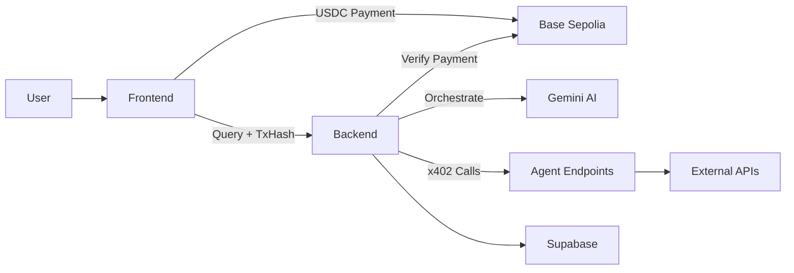

## What is Arcana x402?

Arcana x402 is a multi-agent crypto intelligence platform that combines AI orchestration with blockchain-based micropayments. Built on Base Sepolia, it enables users to access specialized crypto data agents through a simple chat interface - paying only for what they use.

### How it Works

1. **Connect Your Wallet** - Link your Base Sepolia wallet with test USDC
2. **Ask Questions** - Chat naturally about crypto prices, yields, NFTs, news, and more
3. **Pay Per Query** - Each query costs $0.03 USDC, verified on-chain
4. **Get Intelligent Answers** - Gemini AI orchestrates specialized agents to answer your question

<Note>
  All payments use test USDC on Base Sepolia testnet. This is a demonstration platform for hackathon purposes.
</Note>

## Key Features

<CardGroup cols={2}>
  <Card
    title="Paid Query System"
    icon="coins"
  >
    Every chat query requires a $0.03 USDC payment on Base Sepolia, verified on-chain before processing.
  </Card>
  <Card
    title="Multi-Agent Intelligence"
    icon="network-wired"
  >
    Access 7 specialized agents: Price Oracle, Chain Scout, News Scout, Yield Optimizer, Tokenomics Analyzer, NFT Scout, and Perp Stats.
  </Card>
  <Card
    title="x402 Protocol"
    icon="money-bill-transfer"
  >
    Internal tool calls use HTTP 402 payment-required flow with automatic retry after payment settlement.
  </Card>
  <Card
    title="Policy Controls"
    icon="shield-halved"
  >
    Built-in spend limits, freeze controls, and allowlists for safe agent operation.
  </Card>
</CardGroup>

## Available Agents

The platform includes seven specialized agents, each priced individually:

| Agent | Price | Description |
|-------|-------|-------------|
| Price Oracle | $0.01 | Real-time token prices via CoinGecko |
| Chain Scout | $0.01 | On-chain analytics and wallet tracking |
| News Scout | $0.01 | Latest crypto news and trends |
| Yield Optimizer | $0.01 | DeFi yield opportunities across protocols |
| Tokenomics Analyzer | $0.02 | Token economics and distribution analysis |
| NFT Scout | $0.02 | NFT collection stats and floor prices |
| Perp Stats | $0.02 | Perpetual futures market data |

<Warning>
  Agent pricing is separate from the $0.03 user query fee. The backend manages agent payments via x402 protocol.
</Warning>

## Architecture Overview

Arcana x402 consists of three main components:

- **Frontend (React + Vite)** - Chat interface with wallet connection and payment handling
- **Backend (Express + TypeScript)** - Gemini orchestration, x402 payment verification, and agent routing
- **Smart Contracts (Foundry)** - PolicyVault, Escrow, and AgentRegistry on Base Sepolia

## Get Started

<CardGroup cols={2}>
  <Card
    title="Prerequisites"
    icon="list-check"
    href="/prerequisites"
  >
    Set up your wallet, get test tokens, and prepare your environment
  </Card>
  <Card
    title="Quickstart"
    icon="rocket"
    href="/quickstart"
  >
    Make your first paid query in under 5 minutes
  </Card>
</CardGroup>

## What You'll Need

Before diving in, make sure you have:

- A Web3 wallet (MetaMask recommended)
- Base Sepolia testnet ETH for gas
- Base Sepolia test USDC for queries
- A modern web browser

<Note>
  New to Base Sepolia? Don't worry - our quickstart guide walks you through getting testnet tokens from faucets.
</Note>
